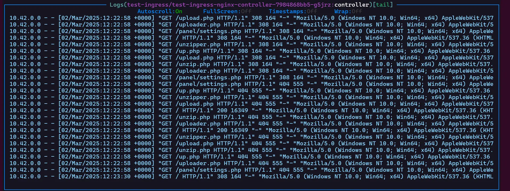
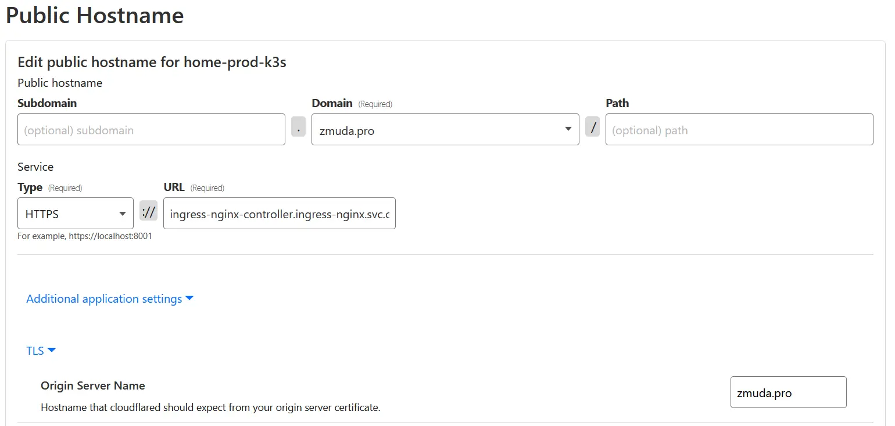
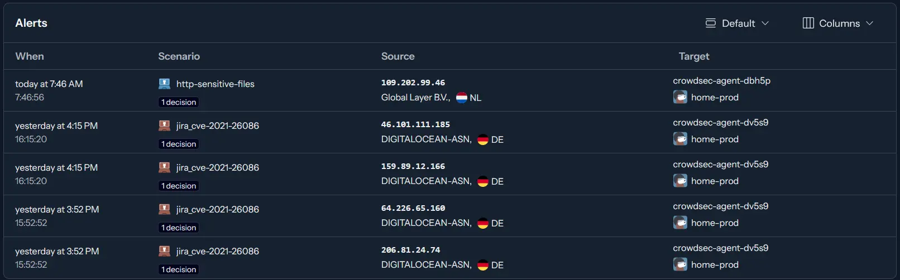

Hosting a public website can be stressful - it's constantly being scanned for vulnerabilities.
Today, I'll share how I used Cloudflare Tunnels, CrowdSec, and NGINX
to block as many threats as possible so I can sleep peacefully at night.

<!-- truncate -->

## Introduction

When I first built my cluster, I took the simplest approach to exposing my website.
I bought a domain, forwarded port 443 on my router, and created a DNS entry.
Finally, I set up [cert-manager](https://cert-manager.io/), and my website was live. Yay!

Even though I knew that any public IP address or website would be scanned for vulnerabilities,
seeing my ingress logs made me uneasy.



A screen full of log entries, all arriving within a second. None of these requests were legitimate.
It became clear that my cluster was constantly being probed for weaknesses.

I didn't want to deal with hundreds of automated scans every day, so I decided to take action:

1. Stop exposing ports on my public IP address.
2. Block requests that scan for known vulnerabilities.

## Act 1 - Cloudflare Tunnels

To address the first point, I decided to use
[Cloudflare Tunnels](https://developers.cloudflare.com/cloudflare-one/connections/connect-networks/get-started/create-remote-tunnel/).

First, we need to delete DNS entries pointing to our public IP.
Then, we can set a Public Hostname in the Cloudflare dashboard (which will recreate the DNS entry).
I used the following settings:



- **Subdomain**: Left empty
- **Domain**: `zmuda.pro`
- **Path**: Left empty
- **Type**: `HTTPS`
- **URL**: `ingress-nginx-controller.ingress-nginx.svc.cluster.local:443` (internal ingress-controller service address)
- **Additional application settings**:
  - **TLS → Origin Server Name**: `zmuda.pro`
  - **TLS → HTTP2 Connection**: Enabled

The **Origin Server Name** is crucial - it tells Cloudflare what subject name to expect on the served certificate.
If you don't have cert-manager set up, you can change the **Type** to `HTTP` instead and update the **URL** to use port `80`.

With Cloudflare configured, it's time to install the client.

### Installing Cloudflared

I found an example configuration
[here](https://github.com/cloudflare/argo-tunnel-examples/blob/master/named-tunnel-k8s/cloudflared.yaml).

I created my own ConfigMap, mirroring the public hostname settings from the previous step:

```yaml
apiVersion: v1
kind: ConfigMap
metadata:
  name: cloudflared
  namespace: cloudflared
data:
  config.yaml: |
    tunnel: 01234567-89ab-cdef-0123-456789abcdef
    credentials-file: /etc/cloudflared/creds/credentials.json
    metrics: 0.0.0.0:2000
    no-autoupdate: true
    ingress:
      - hostname: zmuda.pro
        originServerName: zmuda.pro
        service: https://ingress-nginx-controller.ingress-nginx.svc.cluster.local:443
        http2Origin: true
      - service: http_status:404
```

To create the secret, use this command with your own token from the Cloudflare dashboard:

```bash
kubectl create secret generic tunnel-credentials --from-literal credentials.json=eyJBY...
```

Your website should now be accessible via Cloudflare Tunnels!
You can now safely close the exposed ports on your router.

> **Note:** I tried setting the same configuration using the CLI, but for some reason,
> the Origin Server Name only worked when entered via the dashboard.

### Updating NGINX Configuration

Since Cloudflare acts as a proxy, ingress-nginx logs will only show the IPs of Cloudflared pods.
To preserve real visitor IPs, update your ingress-nginx Helm values:

```yaml
# values.yaml
controller:
  config:
    enable-real-ip: "true"
    forwarded-for-header: "CF-Connecting-IP"
    proxy-real-ip-cidr: "10.0.0.0/8,173.245.48.0/20,103.21.244.0/22,103.22.200.0/22,103.31.4.0/22,141.101.64.0/18,108.162.192.0/18,190.93.240.0/20,188.114.96.0/20,197.234.240.0/22,198.41.128.0/17,162.158.0.0/15,104.16.0.0/13,104.24.0.0/14,172.64.0.0/13,131.0.72.0/22"
    use-forwarded-headers: "true"
# The rest of the config
```

- `enable-real-ip`: Enables real user IP logging.
- `forwarded-for-header`: Cloudflare sends the real user IP in the `CF-Connecting-IP` header.
- `proxy-real-ip-cidr`: Includes Cloudflare's [official IP list](https://www.cloudflare.com/ips-v4/#) and private `10.0.0.0/8` addresses.
- `use-forwarded-headers`: Enables `X-Forwarded-*` headers, which we'll need for CrowdSec later.

## Act 2 - CrowdSec

> :warning: **Warning:** Ingress NGINX version 1.12 or higher is not currently supported by CrowdSec due to the removal of Lua plugin support.
> See [this issue](https://github.com/crowdsecurity/cs-openresty-bouncer/issues/60) for updates.
> I'm using the ingress-nginx Helm chart version `4.11.x` for this reason.

While Cloudflare protects against DDoS attacks, what about vulnerability scanners flooding our logs?
[CrowdSec](https://www.crowdsec.net/) helps automatically ban known malicious IPs.

### Installing CrowdSec

I followed [CrowdSec's documentation](https://doc.crowdsec.net/u/getting_started/installation/kubernetes)
to install it.

To make CrowdSec recognize `X-Forwarded-For` headers, update its configuration:

```yaml
# values.yaml
config:
  config.yaml.local: |
    api:
      server:
        use_forwarded_for_headers: true
        auto_registration:
          enabled: true
          token: "${REGISTRATION_TOKEN}"
          allowed_ranges:
            - "10.0.0.0/8"
agent:
  acquisition:
    - namespace: ingress-nginx
      podName: ingress-nginx-*
      program: nginx-ingress-controller
  env:
    - name: COLLECTIONS
      value: "crowdsecurity/nginx"
# The rest of the config
```

### Updating Ingress-NGINX for CrowdSec

To enable CrowdSec's bouncer plugin in ingress-nginx, follow the [official guide](https://docs.crowdsec.net/u/bouncers/ingress-nginx).

To simplify maintenance, I created a separate `crowdsec-values.yaml` file and passed it along with the standard `values.yaml` for ingress-nginx.

After deploying everything, you can check your [CrowdSec alerts](https://app.crowdsec.net/alerts).



It looks like it's working!

## Summary

With this setup, I feel confident that my cluster is secure.
A DDoS attack would need to take down Cloudflare first, and CrowdSec ensures that known malicious actors are blocked automatically.

Now I can sleep peacefully, knowing my website is well-protected. 😴
