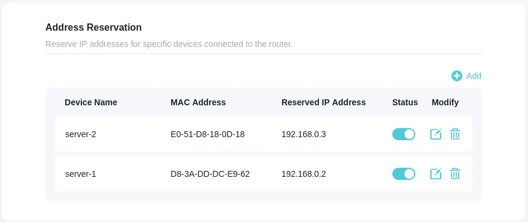

You are probably familiar with the concept of Infrastructure as Code (IaC).
You want your cluster to be created in a repeatable and predictable way.
Today I'll show you how I use Ansible and ArgoCD to automate the creation of my Kubernetes (k3s) cluster.

<!-- truncate -->

## Introduction

At some point in the future you might add more nodes to your cluster,
or you might want to recreate the cluster from scratch because of some issues.
Will you remember everything you had installed on each node?
Will you remember all the configuration changes you made?
I surely wouldn't. That's why whenever I want to install something on my nodes,
I use ansible to do it. It is way slower than just running the commands manually,
but if I ever add another server it will take me minutes to install everything I need.

## Node preparation

Before I start installing OS in my nodes, I need to prepare a few things.
I go to BIOS and set the boot order to boot from USB first.
I make sure that server automatically boots after when power is restored.

I haven't figured out an automated way to install OS on my nodes, so I just followed
[Debian GNU/Linux Installation Guide](https://www.debian.org/releases/testing/amd64/index.en.html) 
and used a USB stick with Debian installer.
During the installation I create a user and add a public ssh key
I generated on my laptop to the `~/.ssh/authorized_keys` file.

Last thing is to set up a static IP address for each node. I have a TP-Link router and I can do it in the web interface:

## Ansible

