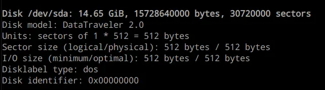

You are probably familiar with the concept of Infrastructure as Code (IaC).
You want your cluster to be created in a repeatable and predictable way.
Today I'll show you how I prepare new nodes to be added to my cluster.

<!-- truncate -->

## Introduction

Currently, I have a 2-node k3s cluster. One node runs on Raspberry Pi 5 8GB,
and the other one is a GMKTec G3 Plus mini-pic with an Intel N150.

I decided to homogenize my cluster and buy two more GMKTec G3 Plus minis to replace
the Raspberry Pi. Luckily I use ansible and ArgoCD to manage my cluster, so adding new nodes
is a breeze.

This will be a 3-part series where I'll walk through the process of preparing
a new node, installing k3s using ansible, and deploying my workloads using ArgoCD.

## Node preparation

### Creating a bootable USB stick

I use Debian because it is lightweight and stable.

1. Download the DVD/USB `.iso` file from the
   [Downloading Debian](https://www.debian.org/CD/http-ftp/#stable) page.
2. Connect a USB stick to your computer and check its device name:
   ```bash
   sudo fdisk -l
   ```
   
3. Copy the `.iso` file [to the USB stick](https://www.debian.org/releases/testing/amd64/ch04s03.en.html).
   ```bash
   sudo cp debian-12.10.0-amd64-DVD-1.iso /dev/sda
   sync
   ```

### BIOS settings

Before I start installing OS on my nodes, I make sure that the server
automatically boots after power loss. I do it in the BIOS settings:

> Wake on Power is a feature that allows the server to automatically power on after a power loss.

### Installing OS

<!-- TODO: Add screenshots -->

During the installation I create a user and add a public ssh key
I generated on my laptop to the `~/.ssh/authorized_keys` file.

### Setting up static IP

Last thing is to set up a static IP address for each node. I have a TP-Link router and I can do it in the web interface:

