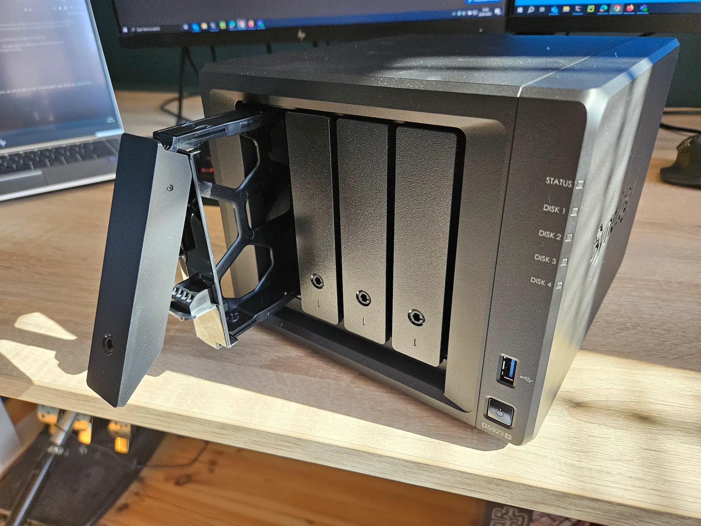
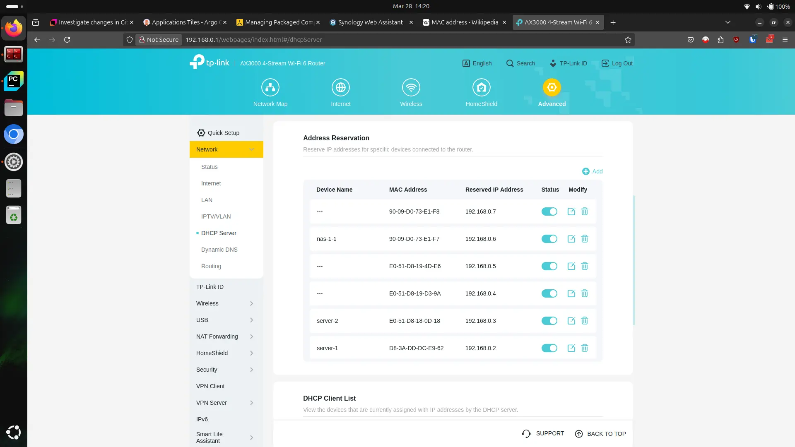

Some services require persistent storage. You could use `hostPath` or `local-storage` class provided by k3s,
but it couples the pod with the node. Longhorn fixes this problem by providing a distributed storage system,
but I found it to be slow and unreliable on my low-end hardware. I decided to switch to iSCSI provided by my Synology NAS.

<!-- truncate -->

## Introduction

My Synology DS923+ was delivered today, along with 2 Synology HAT3310-12T drives and SNV3410-400G SSD for caching.
I decided to use Synology, because they provide Kubernetes CSI drivers for their NAS devices.

After installing the drives, but before I connected the NAS to the network, I logged in to my router
and reserved 2 IP address for the NAS. I named `nas-1-1` and `nas-1-2` since DS923+ has 2 separate network adapters.

After starting the NAS, I connected opened <https://finds.synology.com> and connected to the NAS.
