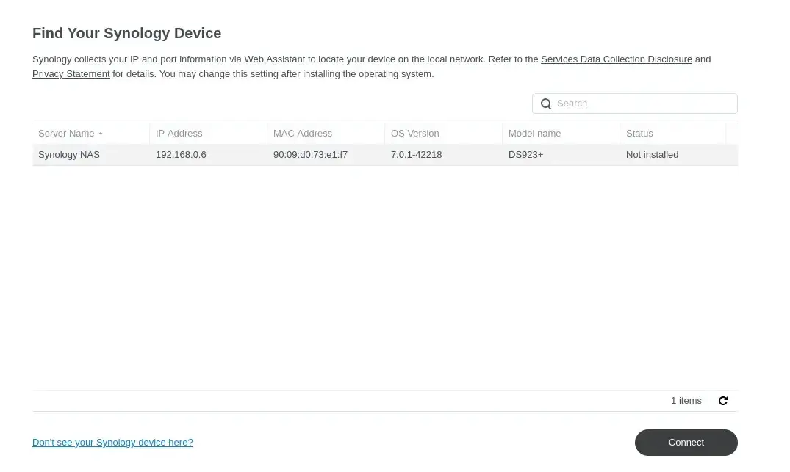

Some services require persistent storage. You could use `hostPath` volume
or `local-storage` storage class provided by k3s,
but it couples the pod with the node.
Longhorn fixes this problem by providing a distributed storage system,
but I found it to be slow and unreliable on my low-end hardware.
I decided to move my data to dedicated storage server.

<!-- truncate -->

## Introduction

My Synology DS923+ was delivered today, along with 2 Synology HAT3310-12T drives and SNV3410-400G SSD for caching.
I decided to use Synology, because they provide Kubernetes CSI drivers for their NAS devices.


After installing the drives, but before I connected the NAS to the network, I logged in to my router
and reserved 2 IP address for the NAS. I named it `nas-1-1`. DS923+ has 2 separate network adapters, so I also
reserved an IP address for the second adapter, but I won't be named until I connect it to the network.


After starting the NAS, I opened [https://finds.synology.com](https://finds.synology.com)
on my laptop and connected to the NAS.



Quick setup was easy, I just had to choose the disks and the RAID type.
I chose SHR (Synology Hybrid RAID) with 1 disk fault tolerance.


I also wanted to make sure that my drive are healthy,
so I chose to run the drive check. It will take about 13 hours, so I will check it tomorrow.


Last thing I needed to do was to create a user that will be used by the CSI driver.
To do that I opened the `Control Panel` and clicked on `User & Group`.
I named the user `kubernetes` so it's clear what it does.
The account needs to be an administrator, so a strong password is a must.


## Synology CSI Driver for Kubernetes

With the drive check running it's time to prepare the cluster for data migration.
Synology CSI Driver for Kubernetes is available
on [GitHub/SynologyOpenSource/synology-csi](https://github.com/SynologyOpenSource/synology-csi).

The instruction asks to clone the repository, create a `client-config.yaml` file and run a script to
deploy the driver.
However, I'm using ArgoCD, so I want my configuration to be in manifests in my repository.

I'll start with `Application` manifest:

```yaml
apiVersion: argoproj.io/v1alpha1
kind: Application
metadata:
  name: synology-csi
  namespace: argocd
  finalizers:
    - resources-finalizer.argocd.argoproj.io
  annotations:
    argocd.argoproj.io/sync-wave: "-30"
spec:
  project: default
  source:
    path: manifests/base/synology-csi
    repoURL: 'https://github.com/theadzik/homelab'
    targetRevision: HEAD
  destination:
    server: https://kubernetes.default.svc
  syncPolicy:
    automated:
      prune: true
      selfHeal: true
```

Then I copied contents of [deploy/kubernetes/v1.20](https://github.com/SynologyOpenSource/synology-csi/tree/main/deploy/kubernetes/v1.20)
directory to my repository under `manifests/base/synology-csi`.

Now I needed to pass client-info configuration to the driver.
I saved the file in `manifests/base/synology-csi/configs/client-info-secret.yaml`.

```yaml
# client-info-secret.yml
---
clients:
  - host: "192.168.0.6"
    port: 5000
    https: false
    username: "kubernetes"
    password: "correct-horse-battery-staple"
```

It feels a bit weird that my NAS configuration goes into `client` section, but that is correct.

> Note: I use git-crypt to encrypt secrets in my repository and a custom ArgoCD image that can decrypt them.
> Don't put unencrypted secrets in your repository.

Now we need to edit `storage-class.yml` to match our storage pool.
I want to have 2 storage classes, one for `Retain` and one for `Delete` policy.
Both of them should be using `btrfs` file system type.

```yaml
apiVersion: storage.k8s.io/v1
kind: StorageClass
metadata:
  name: synology-iscsi-retain
  annotations:
    storageclass.kubernetes.io/is-default-class: "true"
provisioner: csi.san.synology.com
parameters:
  fsType: 'btrfs'
reclaimPolicy: Retain
allowVolumeExpansion: true

---
apiVersion: storage.k8s.io/v1
kind: StorageClass
metadata:
  name: synology-iscsi-delete
  annotations:
    storageclass.kubernetes.io/is-default-class: "false"
provisioner: csi.san.synology.com
parameters:
  fsType: 'btrfs'
reclaimPolicy: Delete
allowVolumeExpansion: true
```

I made the Synology VolumeSnapshotClass default in `volume-snapshot.class.yml`

```yaml
apiVersion: snapshot.storage.k8s.io/v1
kind: VolumeSnapshotClass
metadata:
  name: synology-snapshot-class
  annotations:
    storageclass.kubernetes.io/is-default-class: "true"
driver: csi.san.synology.com
deletionPolicy: Delete
parameters:
  description: 'Kubernetes CSI'
  is_locked: 'false'
```

Lastly, I created `kustomization.yaml` file to glue it all together:

```yaml
apiVersion: kustomize.config.k8s.io/v1beta1
kind: Kustomization
namespace: synology-csi
resources:
  - controller.yml
  - csi-driver.yml
  - namespace.yml
  - node.yml
  - storage-class.yml
  - snapshotter/snapshotter.yaml
  - volume-snapshot-class.yml
secretGenerator:
  - name: client-info-secret
    files:
      - configs/client-info-secret.yaml
```

I pushed the changes to my repository and waited for ArgoCD to deploy the driver.
