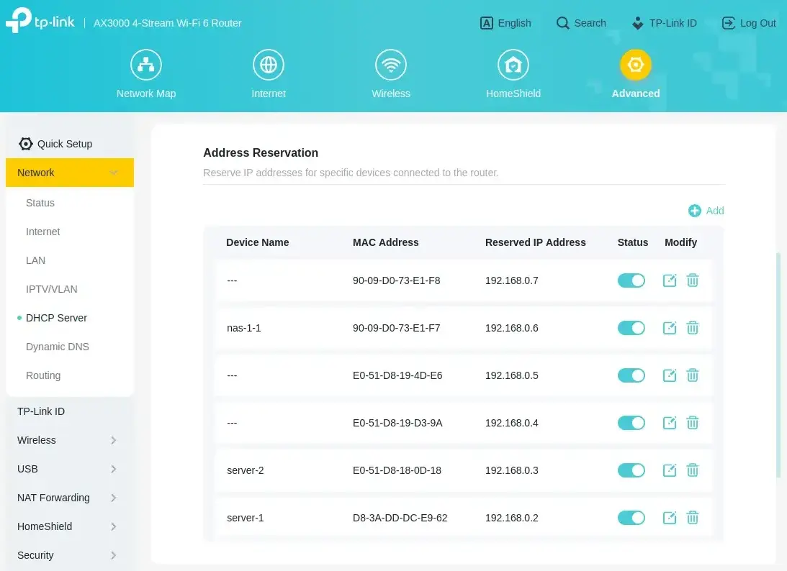

Some services require persistent storage. You could use `hostPath` volume or `local-storage` storage class provided by k3s,
but it couples the pod with the node. Longhorn fixes this problem by providing a distributed storage system,
but I found it to be slow and unreliable on my low-end hardware. I decided to switch to iSCSI provided by my Synology NAS.

<!-- truncate -->

## Introduction

My Synology DS923+ was delivered today, along with 2 Synology HAT3310-12T drives and SNV3410-400G SSD for caching.
I decided to use Synology, because they provide Kubernetes CSI drivers for their NAS devices.

After installing the drives, but before I connected the NAS to the network, I logged in to my router
and reserved 2 IP address for the NAS. I named it `nas-1-1`. DS923+ has 2 separate network adapters, so I also
reserved an IP address for the second adapter, but I won't be named until I connect it to the network.

After starting the NAS, I opened [https://finds.synology.com](https://finds.synology.com) and connected to the NAS.

Quick setup was easy, I just had to choose the disks and the RAID type.
I chose SHR (Synology Hybrid RAID) with 1 disk fault tolerance.

I also wanted to make sure that my drive are healthy,
so I chose to run the drive check. It will take about 13 hours, so I will check it tomorrow.

## iSCSI CSI driver

With the drive check running it's time to prepare the cluster for migration.

