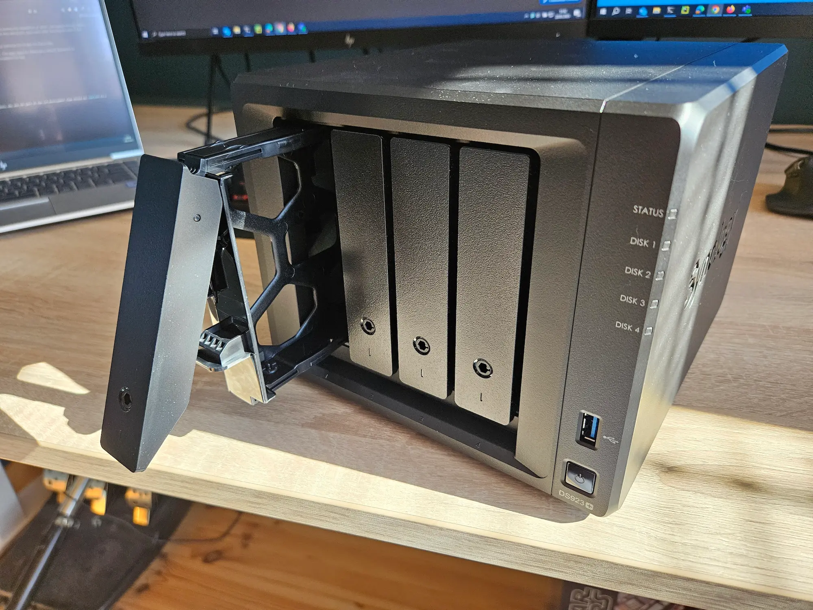
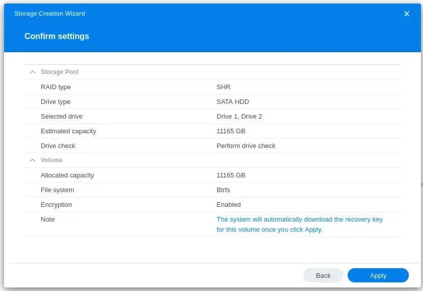
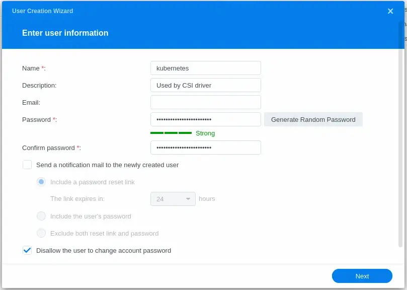
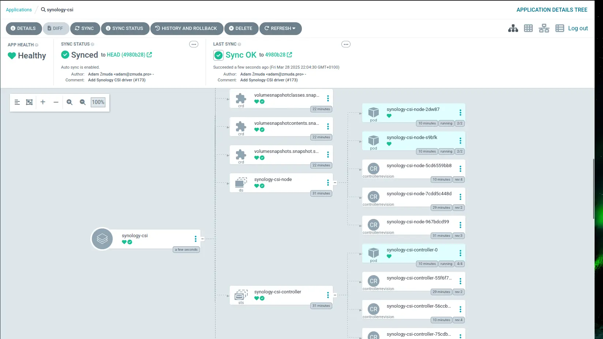
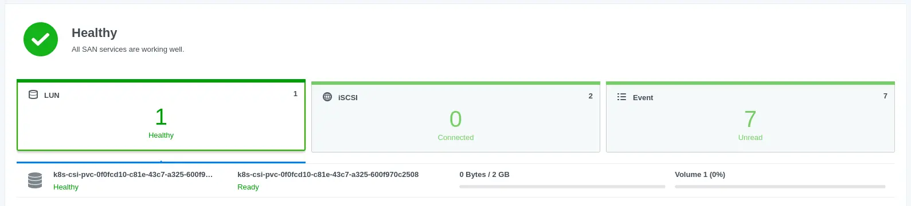

Some services require persistent storage.
You could use `hostPath` volume or `local-storage` storage class provided by k3s,
but it couples the pod with the node.
Longhorn fixes this problem by providing a distributed storage system,
but I found it to be slow and unreliable on my low-end hardware.
I decided to move my data to a dedicated storage server.

<!-- truncate -->

## NAS Setup

My Synology DS923+ was delivered today,
along with 2 Synology HAT3310-12T drives and an SNV3410-400G SSD for caching.
I decided to use Synology because of their Synology Hybrid Raid (SHR).
It allows you to seamlessly add more disks and create storage pools on drives with different sizes.
They also provide Kubernetes CSI drivers, which was crucial for me.



### Reserving IP Addresses

After installing the drives, but before I connected the NAS to the network,
I logged in to my router and reserved 2 IP addresses for the NAS.
The DS923+ has 2 network adapters, so I reserved two IP addresses.
I named the first one `nas-1-1` and the second one will stay blank,
until I connect it to the router.


### Connecting to the NAS

After starting the NAS, I opened [https://finds.synology.com](https://finds.synology.com)
on my laptop and connected to the NAS.


### Initial Setup

Going through the wizard was quick and easy.
I chose both of my disks, set the RAID type to SHR with 1 disk fault tolerance,
and used the recommended Btrfs file system.



### Running Drive Check

I also wanted to make sure that my drives were not damaged in transport,
so I chose to run the drive check. It will take about 13 hours.
I will come back to check the results later.


### Creating a User for the CSI Driver

The last thing I needed to do was to create a user that will be used by the CSI driver.
To do that, I opened the `Control Panel` and clicked on `User & Group`.
I named the user `kubernetes` so it's clear what it does.
The account needs to be an administrator, so a strong password is a must.



## Installing CSI Driver for Kubernetes

With the drive check running, it's time to prepare the cluster for data migration.
The Synology CSI Driver for Kubernetes is available on
[GitHub/SynologyOpenSource/synology-csi](https://github.com/SynologyOpenSource/synology-csi).

The instructions ask to clone the repository,
create a `client-config.yaml` file, and run a script to deploy the driver.
However, I'm using ArgoCD, so I want my configuration to be in manifests in my repository.

### Creating Application Manifest

I'll start with the `Application` manifest:

```yaml
apiVersion: argoproj.io/v1alpha1
kind: Application
metadata:
  name: synology-csi
  namespace: argocd
  finalizers:
    - resources-finalizer.argocd.argoproj.io
  annotations:
    argocd.argoproj.io/sync-wave: "-30"
spec:
  project: default
  source:
    path: manifests/base/synology-csi
    repoURL: 'https://github.com/theadzik/homelab'
    targetRevision: HEAD
  destination:
    server: https://kubernetes.default.svc
  syncPolicy:
    automated:
      prune: true
      selfHeal: true
```

Then I copied the contents
of [deploy/kubernetes/v1.20](https://github.com/SynologyOpenSource/synology-csi/tree/main/deploy/kubernetes/v1.20)
directory to my repository under `manifests/base/synology-csi`.

### Configuring Client Info

Now I needed to pass client-info configuration to the driver.
I saved the file in `manifests/base/synology-csi/configs/client-info-secret.yaml`.

```yaml
# client-info-secret.yml
clients:
  - host: "192.168.0.6"
    port: 5000
    https: false
    username: "kubernetes"
    password: "correct-horse-battery-staple"
```

It feels a bit weird that my NAS configuration goes into **client** and not **server** section, but that is correct.

> Note: I use git-crypt to encrypt secrets in my repository and a custom ArgoCD image that can decrypt them.
> Don't put unencrypted secrets in your repository.

### Editing Storage Class and Volume Snapshot Class

Now we need to edit `storage-class.yml` to match our storage pool.
I want to have 2 storage classes, one with `Retain` and one for `Delete` policy.
Both of them should be using `btrfs` file system type.

```yaml
apiVersion: storage.k8s.io/v1
kind: StorageClass
metadata:
  name: synology-iscsi-retain
  annotations:
    storageclass.kubernetes.io/is-default-class: "true"
provisioner: csi.san.synology.com
parameters:
  fsType: 'btrfs'
reclaimPolicy: Retain
allowVolumeExpansion: true

---

apiVersion: storage.k8s.io/v1
kind: StorageClass
metadata:
  name: synology-iscsi-delete
  annotations:
    storageclass.kubernetes.io/is-default-class: "false"
provisioner: csi.san.synology.com
parameters:
  fsType: 'btrfs'
reclaimPolicy: Delete
allowVolumeExpansion: true
```

I made the Synology VolumeSnapshotClass default in `volume-snapshot.class.yml`

```yaml
apiVersion: snapshot.storage.k8s.io/v1
kind: VolumeSnapshotClass
metadata:
  name: synology-snapshot-class
  annotations:
    storageclass.kubernetes.io/is-default-class: "true"
driver: csi.san.synology.com
deletionPolicy: Delete
parameters:
  description: 'Kubernetes CSI'
  is_locked: 'false'
```

### Installing CRDs

Lastly, we need to make sure we have CRDs installed for our snapshotter.
We can add a link to git repo directly in our `kustomization.yaml` file.

```yaml
apiVersion: kustomize.config.k8s.io/v1beta1
kind: Kustomization
namespace: synology-csi
resources:
  - github.com/kubernetes-csi/external-snapshotter/client/config/crd?ref=v8.2.0
  - controller.yml
  - csi-driver.yml
  - namespace.yml
  - node.yml
  - storage-class.yml
  - snapshotter/snapshotter.yml
  - snapshotter/volume-snapshot-class.yml
secretGenerator:
  - name: client-info-secret
    files:
      - client-info.yml=configs/client-info-secret.yml
```

> Note: I'm using `kustomize` to generate the secret from the file.
> To automatically encrypt secrets I need to add "secret" to the name.
> The driver expects the key in secret to be named `client-info.yml` so I had to
> rename the file in the secretGenerator.

I pushed the changes to my repository and waited for ArgoCD to deploy the driver.



## Testing

Once done, I could test it everything works by creating a PVC:

```yaml
# test.aml
apiVersion: v1
kind: PersistentVolumeClaim
metadata:
  name: test
  namespace: test
spec:
  accessModes:
    - ReadWriteMany
  resources:
    requests:
      storage: 2Gi
  storageClassName: synology-iscsi-delete
```

```bash
$ k apply -f test.yaml -n test
persistentvolumeclaim/test created
$ k get pvc -n test
NAME   STATUS   VOLUME                                     CAPACITY   ACCESS MODES   STORAGECLASS            VOLUMEATTRIBUTESCLASS   AGE
test   Bound    pvc-0f0fcd10-c81e-43c7-a325-600f970c2508   2Gi        RWX            synology-iscsi-retain   <unset>                 73s
```

Looks like everything is working but let's check Synology to make sure
the volume was created.



Success! The volume was created and is ready to be used.
