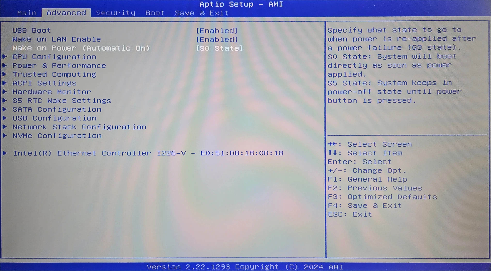

You are probably familiar with the concept of Infrastructure as Code (IaC).
I want my cluster to be created in a repeatable and predictable way.
Here's how I prepare new nodes to be added to my cluster using Debian Preseeding.

<!-- truncate -->

## Introduction

Currently, I have a 2-node k3s cluster. One node runs on RaspberryPi 5 8GB,
and the other one is a GMKTec G3 Plus mini-pic with an Intel N150 CPU.

I decided to homogenize my cluster and buy two more GMKTec G3 Plus minis to replace
the RaspberryPi. Luckily I use ansible and ArgoCD to manage my cluster, so adding new nodes
is a breeze.

This will be the first post of a three part series where I'll walk through the process of installing Debian on
a new node, hardening security and installing k3s using ansible, and deploying my workloads using ArgoCD.

## OS Selection

I use Debian because it is lightweight and stable. I'll be installing it
offline (because I'm too lazy to drag a monitor to my server closet
where I have cable connection)
using a USB stick. I also want the setup to be repeatable and fast, so I'll use
[Debian Preseeding](https://wiki.debian.org/DebianInstaller/Preseed) option to
automate the installation as much as possible.

In the future I'll experiment with [Talos Linux](https://www.talos.dev/), but for now I’d like to
keep it simple and use Debian.

## Creating preseed.cfg

I'll start with creating a **preseed.cfg** file. It will provide answers to
questions asked during the installation process. I’d like to make my **preseed.cfg**
reusable for all of my servers in the future, so I'll manually provide hostname
and IP address.

### Generating password hash for my user

First, I'll generate a password hash that I'll use to log in to my account.
You can put our password in plain text to the preseed.cfg file, but it is
better to hash it in case someone steals our USB stick.

You can use any hashing algorithm supported by **/etc/shadow** file.
I used SHA-512. The salt can be any random 16-character string. You don't need to write it down,
it will become a part of hash itself.
The second string is the actual password we will use.

```bash
$ openssl passwd -6 -salt '4JxutxWgeoBgd8oM' 'correct-horse-battery-staple'
$6$4JxutxWgeoBgd8oM$Nu6lKZb4jhtF.mNHCdafEL8IVgoRILLaLVuhr.QlF27j4CZKurZ5ADAT0pFCOGJc1TUf4azPy6k/hT/vZtj3c0
```

🦍🦍🦍

### Generating SSH keys

I'll only use password
for sudo access but will log in to the server with ssh keys.

:::note
If you already have ssh keys generated you can simply get them from
`cat ~/.ssh/*.pub`
:::

To generate a key pair I use **ssh-keygen**.

```bash
$ ssh-keygen -t ed25519 -C "adam@zmuda.pro"
```

* `-t ed25519` is an algorithm to use
* `-C adam@zmuda.pro` It's a comment added at the end of the public key.
  It's a comment to help you identify what the key is used for. I usually put my
  email address there because I use same keys for multiple purposes.

Make a note of the ***public*** key. As the name suggests it is public. You can share it freely with anyone.

```bash
$ cat ~/.ssh/id_ed25519.pub
ssh-ed25519 AAAAC3NzaC1lZDI1NTE5AAAAIKk7j5NrdCVSvPiDBoqUM/VC5ltpWjXRqEgCyjptugmp adam@zmuda.pro
```

### Generating preseed.cfg

Now I’m ready to create a **preseed.cfg** file.
I started with the [Debian Preseed Example](https://www.debian.org/releases/stable/example-preseed.txt) as a base.
I answered all the questions I could and left the rest. My plan was to just use the file and see what other questions
do I get.
When during installation a question popped up. I would find it in
[this list](https://preseed.debian.net/debian-preseed/bookworm/amd64-main-full.txt) to translate a question
to a preseed.cfg key I need to use.

```txt title="preseed.cfg"
#_preseed_V1
### Localization
d-i debian-installer/language string en
d-i debian-installer/country string PL
d-i debian-installer/locale string C.UTF-8
d-i localechooser/supported-locales multiselect pl_PL.UTF-8
d-i console-setup/codeset47 select guess

# Keyboard selection.
d-i keyboard-configuration/xkb-keymap select pl

# Network configuration
d-i netcfg/choose_interface select auto
d-i netcfg/disable_autoconfig boolean true
d-i netcfg/dhcp_options select Do not configure the network at this time
d-i netcfg/get_gateway string 192.168.0.1
d-i netcfg/get_netmask string 255.255.0.0
d-i netcfg/get_nameservers string
d-i netcfg/get_domain string internal

d-i netcfg/wireless_wep string

d-i mirror/country string manual
d-i mirror/http/hostname string http.us.debian.org
d-i mirror/http/directory string /debian
d-i mirror/http/proxy string

# Disable root login
d-i passwd/root-login boolean false

# Create my user
d-i passwd/user-fullname string Adam Żmuda
d-i passwd/username string adzik
d-i passwd/user-password-crypted password $6$4G*jdj*YDIJ 23d$gayXuxqZTVf/lBH2dq1e8D7ztjZiGph/P5IZPxCiUJfaOGJfbWjqZcpDc5NWghUTA8xE0bPV4FIbUTahREy9V0

# Set up time
d-i clock-setup/utc boolean true
d-i time/zone string Europe/Warsaw
d-i clock-setup/ntp boolean false

# Partitioning
d-i partman-auto/disk string /dev/nvme0n1 # Automatically use whole SSD
d-i partman-auto/method string lvm
d-i partman-auto-lvm/guided_size string max

d-i partman-lvm/device_remove_lvm boolean true
d-i partman-md/device_remove_md boolean true
d-i partman-lvm/confirm boolean true
d-i partman-lvm/confirm_nooverwrite boolean true
d-i partman-auto/choose_recipe select atomic

d-i partman-partitioning/confirm_write_new_label boolean true
d-i partman/choose_partition select finish
d-i partman/confirm boolean true
d-i partman/confirm_nooverwrite boolean true

d-i partman-md/confirm boolean true
d-i partman-partitioning/confirm_write_new_label boolean true
d-i partman/choose_partition select finish
d-i partman/confirm boolean true
d-i partman/confirm_nooverwrite boolean true

# Configure the package manager
d-i apt-setup/cdrom/set-first boolean false
d-i apt-setup/use_mirror boolean true
d-i apt-setup/mirror/error select Ignore

d-i popularity-contest/participate boolean false

# Headless server configuration
tasksel tasksel/first multiselect standard, ssh-server

# Ignore other OS on the disk
d-i grub-installer/only_debian boolean true
d-i grub-installer/with_other_os boolean true

# Shut down after installation
d-i finish-install/reboot_in_progress note
d-i debian-installer/exit/poweroff boolean true

# Add ssh key for my user, and apt sources
d-i preseed/late_command string \
in-target export USERNAME=adzik; \
in-target mkdir -p /home/$USERNAME/.ssh; \
in-target /bin/sh -c "echo 'ssh-ed25519 AAAAC3NzaC1lZDI1NTE5AAAAIKk7j5NrdCVSvPiDBoqUM/VC5ltpWjXRqEgCyjptugmp adam@zmuda.pro' >> /home/$USERNAME/.ssh/authorized_keys"; \
in-target chown -R $USERNAME:$USERNAME /home/$USERNAME/.ssh/; \
in-target chmod 644 /home/$USERNAME/.ssh/authorized_keys; \
in-target chmod 700 /home/$USERNAME/.ssh/; \
in-target /bin/sh -c "echo 'deb http://deb.debian.org/debian/ bookworm main non-free-firmware\n' > /etc/apt/sources.list"; \
in-target /bin/sh -c "echo 'deb-src http://deb.debian.org/debian/ bookworm main non-free-firmware\n\n' >> /etc/apt/sources.list"; \
in-target /bin/sh -c "echo 'deb http://security.debian.org/debian-security bookworm-security main non-free-firmware\n' >> /etc/apt/sources.list"; \
in-target /bin/sh -c "echo 'deb-src http://security.debian.org/debian-security bookworm-security main non-free-firmware\n\n' >> /etc/apt/sources.list"; \
in-target /bin/sh -c "echo 'deb http://deb.debian.org/debian/ bookworm-updates main non-free-firmware\n' >> /etc/apt/sources.list"; \
in-target /bin/sh -c "echo 'deb-src http://deb.debian.org/debian/ bookworm-updates main non-free-firmware\n' >> /etc/apt/sources.list";
```

This last section is a **late_command**. It runs after the installation is finished. You can do
whatever you want there. I used it to add my public ssh key to the `~/.ssh/authorized_keys` file
and add the apt sources to the `/etc/apt/sources.list` file. Just remember to prefix each command with `in-target`.

## Creating a writable installation USB stick

1. Download the DVD/USB `.iso` file from the
   [Downloading Debian](https://www.debian.org/CD/http-ftp/#stable) page.
2. Connect a USB stick to your computer and check its device name:
   ```bash
   $ fdisk -l
   ```
   

3. I'll prepare [WritableUSBStick](https://wiki.debian.org/DebianInstaller/WritableUSBStick),
   so I can add my preseed.cfg file to it.

   1. I'll create two directories I'll use to mount my
      USB stick and the **.iso** file I downloaded.
      ```bash
      $ mkdir /mnt/cdrom
      $ mkdir /mnt/data
      ```
   2. Then I'll format the stick and mount it
      ```bash
      $ parted --script /dev/sda mklabel msdos
      $ parted --script /dev/sda mkpart primary fat32 0% 100%
      $ mkfs.vfat /dev/sda1
      $ mount /dev/sda1 /mnt/data
      ```

      :::note
      Replace /dev/sda with your device name from the previous step
      :::

   3. Now I'll mount the **.iso** file and copy its contents
      to USB.

      ```bash
      $ mount -o loop debian-12.4.0-amd64-netinst.iso /mnt/cdrom/
      $ rsync -av /mnt/cdrom/ /mnt/data/
      $ umount /mnt/cdrom
      ```

4. Copy the preseed.cfg file to the root directory of USB
   ```bash
   $ cp /path/to/preseed.cfg /mnt/data/preseed.cfg
   ```

5. Because I’d like to provide a hostname during installation I need to change
   the question priority. Normally the installer only asks critical level questions, but the hostname is
   a high priority question. We should also add the **preseed/file** location so we don't need to
   manually type it in. The root of the USB stick is available to the installer under **/cdrom/** path.

   ```txt title="/mnt/data/boot/grub/grub.cfg"
       menuentry --hotkey=a '... Automated install' { # This is the menu item we will pick during installation
           set background_color=black
           linux    /install.amd/vmlinuz auto=true priority=high preseed/file=/cdrom/preseed.cfg vga=788 --- quiet
           initrd   /install.amd/initrd.gz
       }
   ```

6. When we are done we need to unmount the drive.
   ```bash
   $ umount /mnt/data
   ```

## Node preparation

### BIOS settings

Before I start installing OS on my nodes, I make sure that the server
automatically boots after power loss. I do it in the BIOS settings:

> Wake on Power is a feature that allows the server to automatically power on after a power loss.

Because GMKTec G3 Plus doesn't have a sticker with MAC address on it, I also write it down from the BIOS settings.

### Setting up static IP

Lastly, I'd like to reserve an IP address for each node. I have a TP-Link router and I can do it in the web interface:


### Installing OS

Once that's done, I plug the USB stick into the server and boot from it.

First I select **Advanced options**


Then I select **Automated install**


It'll ask you for the hostname and IP address.


And that's it! My server shuts down after the installation is finished. I take out the USB stick
and plug it into the next server. I repeat the process for all of my servers.

## Final thoughts

It takes some time to create a preseed.cfg file. I needed to iterate over it a few times to get it right.
But now I can install a new server in about 5 minutes.

Next, configuring ansible to install k3s and other required dependencies on all new server.
I'll talk about it in the next part of this series.
