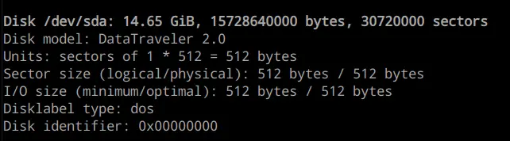
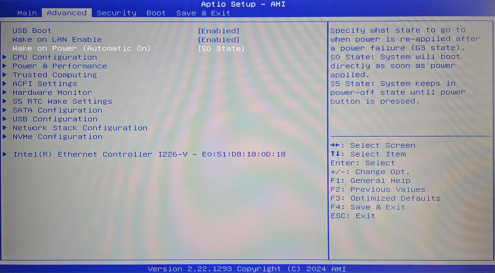

You are probably familiar with the concept of Infrastructure as Code (IaC).
You want your cluster to be created in a repeatable and predictable way.
Today I'll show you how I prepare new nodes to be added to my cluster.

<!-- truncate -->

## Introduction

Currently, I have a 2-node k3s cluster. One node runs on Raspberry Pi 5 8GB,
and the other one is a GMKTec G3 Plus mini-pic with an Intel N150 CPU.

I decided to homogenize my cluster and buy two more GMKTec G3 Plus minis to replace
the Raspberry Pi. Luckily I use ansible and ArgoCD to manage my cluster, so adding new nodes
is a breeze.

This will be a 3-part series where I'll walk through the process of preparing
a new node, installing k3s using ansible, and deploying my workloads using ArgoCD.

## OS Selection

I use Debian because it is lightweight and stable. I'll be installing it
offline (because I'm too lazy to drag a monitor to my server closet
where I have cable connection)
using a USB stick. I also want the setup to be repeatable and fast, so I'll use
[Debian Preseeding](https://wiki.debian.org/DebianInstaller/Preseed) option to
automate the installation as much as possible.

## Creating preseed.cfg

I will start with creating a **preseed.cfg** file. It will provide answers to
questions asked during the installation process. I want to make my **preseed.cfg**
reusable for all of my servers in the future, so I will manually provide hostname
and IP address.

### Generating password hash for my user

First I will generate a password hash that I will use to log in to my account.
We can put our password in plain text to the preseed.cfg file, but it is
better to hash it in case someone steals our USB stick.

We can use any hashing algorithm supported by **/etc/shadow** file.
I used SHA-512. The salt can be any random 16-character string. You don't need to write it down,
it will become a part of hash itself.
The second string is the actual password we will use.

```bash
$ openssl passwd -6 -salt '4G*jdj*YDIJ 23d' 'correct-horse-battery-staple'
$6$4G*jdj*YDIJ 23d$gayXuxqZTVf/lBH2dq1e8D7ztjZiGph/P5IZPxCiUJfaOGJfbWjqZcpDc5NWghUTA8xE0bPV4FIbUTahREy9V0
```

### Generating SSH keys

I will only use password
for sudo access but will log in to the server with ssh keys.

:::note
If you already have ssh keys generated you can simply get them from
`cat ~/.ssh/*.pub`
:::

To generate a key pair I use **ssh-keygen**.

```bash
$ ssh-keygen -t ed25519 -C "adam@zmuda.pro"
```

* `-t ed25519` is an algorithm to use
* `-C adam@zmuda.pro` It's a comment added at the end of the public key.
  It's a comment to help you identify what the key is used for. I usually put my
  email address there because I use same keys for multiple purposes.

Note down the ***public*** key. As the name suggests it is public. You can share it freely with anyone.

```bash
$ cat ~/.ssh/id_ed25519.pub
ssh-ed25519 AAAAC3NzaC1lZDI1NTE5AAAAIKk7j5NrdCVSvPiDBoqUM/VC5ltpWjXRqEgCyjptugmp adam@zmuda.pro
```

### Generating preseed.cfg

## Creating a writable installation USB stick

1. Download the DVD/USB `.iso` file from the
   [Downloading Debian](https://www.debian.org/CD/http-ftp/#stable) page.
2. Connect a USB stick to your computer and check its device name:
   ```bash
   $ fdisk -l
   ```
   

3. I will prepare [WritableUSBStick](https://wiki.debian.org/DebianInstaller/WritableUSBStick),
   so I can add my preseed.cfg file to it.

   1. First I'll create two directories I will use to mount my
      USB stick and the **.iso** file I downloaded.
      ```bash
      $ mkdir /mnt/cdrom
      $ mkdir /mnt/data
      ```
   2. Then I will format the stick and mount it
      ```bash
      $ parted --script /dev/sda mklabel msdos
      $ parted --script /dev/sda mkpart primary fat32 0% 100%
      $ mkfs.vfat /dev/sda1
      $ mount /dev/sda1 /mnt/data
      ```

      :::note
      Replace /dev/sda with your device name from the previous step
      :::

   3. Now I'll mount the **.iso** file and copy its contents
      to USB.

      ```bash
      $ mount -o loop debian-12.4.0-amd64-netinst.iso /mnt/cdrom/
      $ rsync -av /mnt/cdrom/ /mnt/data/
      $ umount /mnt/cdrom
      ```

4. Copy the preseed.cfg file to the root directory of USB
   ```bash
   $ cp /path/to/preseed.cfg /mnt/data/preseed.cfg
   ```

5. Because I want to provide a hostname during installation I need to change
   the question priority. Normally the installer only asks critical level questions, but the hostname is
   a high priority question. We should also add the preseed/file location so we don't need to
   manually type it in. The root of the USB stick is available to the installer under /cdrom/ path.

   ```txt title="/mnt/data/boot/grub/grub.cfg"
       menuentry --hotkey=a '... Automated install' { # This is the menu item we will pick during installation
           set background_color=black
           linux    /install.amd/vmlinuz auto=true priority=high preseed/file=/cdrom/preseed.cfg vga=788 --- quiet
           initrd   /install.amd/initrd.gz
       }
   ```

6. When we are done we need to unmount the drive.
   ```bash
   $ umount /mnt/data
   ```

## Node preparation

### BIOS settings

Before I start installing OS on my nodes, I make sure that the server
automatically boots after power loss. I do it in the BIOS settings:

> Wake on Power is a feature that allows the server to automatically power on after a power loss.

Because GMKTec G3 Plus doesn't have a sticker with MAC address on it, I also write it down from the BIOS settings.

### Setting up static IP

Last thing is to set up a static IP address for each node. I have a TP-Link router and I can do it in the web interface:


### Installing OS

<!-- TODO: Add screenshots -->

During the installation I create a user and add a public ssh key
I generated on my laptop to the `~/.ssh/authorized_keys` file.
