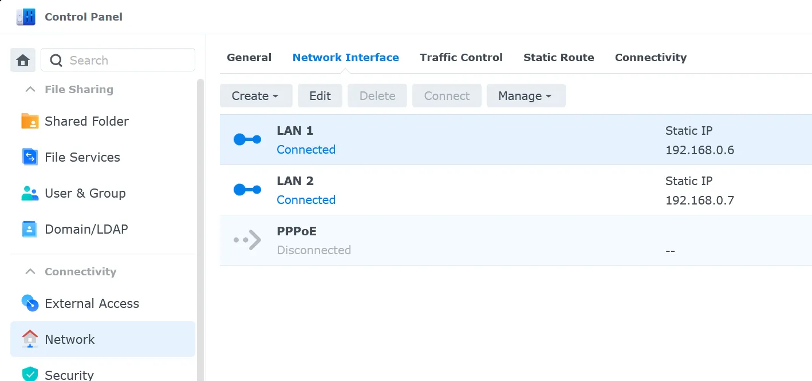
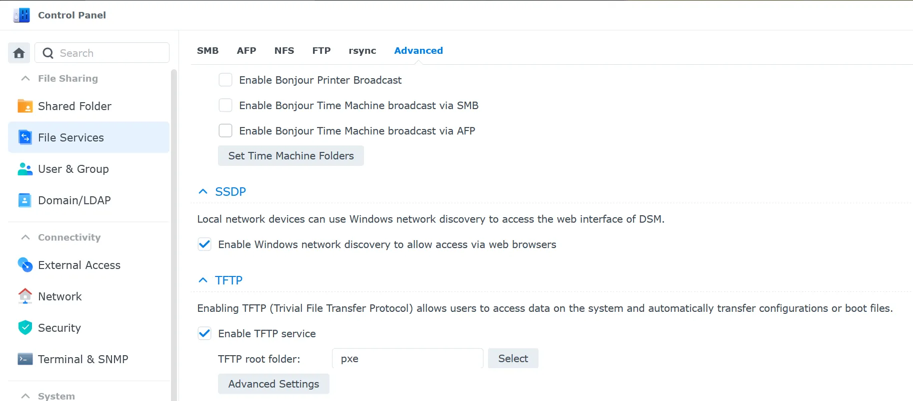
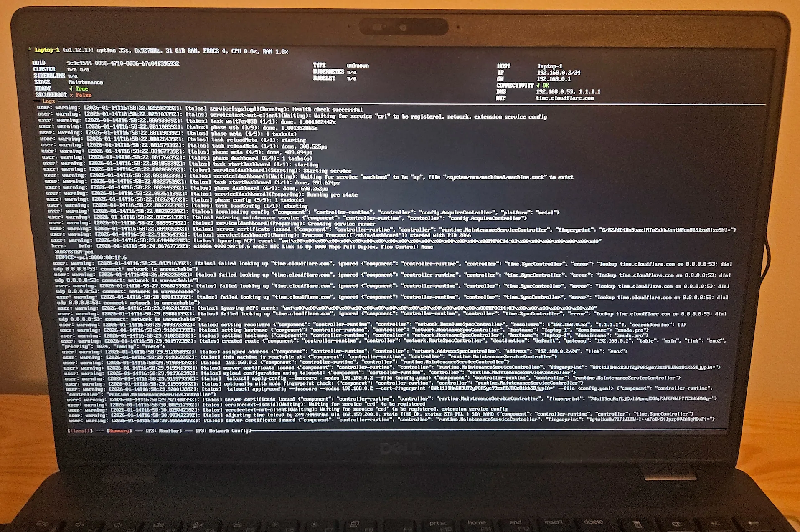

I decided I no longer wanted to run my homelab on Debian.
It was working fine, I had no problems at all... and maybe that was the problem.
I wanted to try something new, get out of my comfort zone and learn new things.
I had heard of Talos and PXE but never actually configured them myself.

<!-- truncate -->

## Why Talos Linux?

During KubeCon Europe 2025 I attended a talk: [Day-2’000 - Migration From Kubeadm+Ansible To
ClusterAPI+Talos](https://www.youtube.com/watch?v=uQ_WN1kuDo0) where Clément Nussbaumer
talked about, among other things, Talos.
It is a minimal Linux distribution designed specifically for running Kubernetes clusters.
It sounded like a good alternative to Debian + k3s. Combining Talos with PXE boot would eliminate the need to
[install an OS from a USB drive](../2025-04-05-os-ansible-argocd-part-1/index.md) and to
[manage configuration with Ansible](../2025-04-06-os-ansible-argocd-part-2/index.md).

## Creating Talos PXE boot images

I started by creating a Talos image using [https://factory.talos.dev](https://factory.talos.dev). It's a simple step-by-step
image creator. I selected options that match my hardware:

- Bare-metal Machine
- The newest Talos version (v1.12.1 at the time of writing)
- amd64 architecture
- SecureBoot disabled
- System Extensions:
  - `siderolabs/i915` for Intel graphics
  - `siderolabs/iscsi-tools` for iSCSI storage
  - `siderolabs/nut-client` for UPS support
- No extra kernel commands
- Bootloader: auto

As a result, I got a schematic and its ID:

```yaml
# ca3fbb9c3bb73ff71b7629ef5b487c827b93878609f361b0e1e555342378b595
customization:
  systemExtensions:
    officialExtensions:
      - siderolabs/i915
      - siderolabs/iscsi-tools
      - siderolabs/nut-client
```

The final page provides links to download several images, but I only needed the Unified Kernel
Image (UKI) for PXE. In the future I won't need to use the web interface: I can save the
schematic ID and fetch the updated image directly:

```text
https://factory.talos.dev/image/<id>/<version>/metal-amd64-uki.efi
```

## Synology setup

Next, I needed to enable PXE and TFTP. Because my router's DHCP does not support PXE, I configured my
NAS to run a DHCP server. If your router supports PXE booting, you can skip the DHCP section below.

### DHCP

The first step is to assign a static IP to Synology so it doesn't need to assign one to itself. It can be done
in **Control Panel** -> **Network** -> **Network Interface** -> **Edit**:



Then I installed the **DHCP Server** package from the **Package Center**.


I opened the **DHCP Server** app -> **Network Interface** -> Select **LAN 1** -> **Edit**
and copied the network settings and client reservations (MACs and IPs) from my router.

Once DHCP was configured on the Synology, I disabled DHCP on my router to avoid conflicts.

### TFTP

Next step was to enable TFTP server on Synology. To do that I created a shared folder named `pxe`
and uploaded the `metal-amd64-uki.efi` file there. Then I went to **Control Panel** -> **File Services** -> **Advanced** tab
and enabled TFTP service, setting the root directory to `/volume1/pxe`:



### PXE

Finally, I configured PXE. In the **DHCP Server** app -> **PXE** tab
I enabled PXE service,
selected Local TFTP server and set the bootloader to `metal-amd64-uki.efi`.


## Testing PXE boot

Now it's time to test if PXE works. I had an unused laptop lying around so I configured its BIOS to boot from
**disk first** and then from network. It may sound counter-intuitive, but it's a recommendation from
[Talos docs](https://docs.siderolabs.com/talos/v1.12/platform-specific-installations/bare-metal-platforms/pxe):

:::note
If there is already a Talos installation on the disk, the machine will boot into that
installation when booting from network. The boot order should prefer disk over network.
:::

I wiped the disk, connected the laptop to my LAN via Ethernet, and powered it on.



Success! The laptop booted into Talos Maintenance Mode.

## Creating Talos configs

The rest of the process is configuring Talos and Kubernetes cluster.
[Getting started guide][getting-started] has all the steps needed,
so I will just summarize them here.

1. Install **talosctl** `brew install talos-systems/tap/talosctl`
2. Generate Talos config files:

   ```bash
   export CONTROL_PLANE_IP=192.168.0.2
   export CLUSTER_NAME=homelab-dev
   export DISK_NAME=nvme0n1

   talosctl gen config $CLUSTER_NAME https://$CONTROL_PLANE_IP:6443 --install-disk /dev/$DISK_NAME
   ```

3. Edit configuration in `controlplane.yaml` and `worker.yaml` files.
   I only added nut-client configuration to the bottom:

   ```yaml
   ---
   apiVersion: v1alpha1
   kind: ExtensionServiceConfig
   name: nut-client
   configFiles:
     - content: |-
         MONITOR ups@192.168.0.6 1 monuser secret secondary
         SHUTDOWNCMD "/sbin/poweroff"
   mountPath: /usr/local/etc/nut/upsmon.conf
   ```

   Yes, the secret to my UPS is "secret". Don't judge me.

4. Apply config, set endpoints:

   ```bash
   talosctl apply-config --insecure --nodes $CONTROL_PLANE_IP --file controlplane.yaml
   talosctl --talosconfig=./talosconfig config endpoints $CONTROL_PLANE_IP
   ```

5. Wait for node to reboot and then bootstrap ETCD and get kubeconfig:

   ```bash
   talosctl bootstrap --nodes $CONTROL_PLANE_IP --talosconfig=./talosconfig
   talosctl health --nodes $CONTROL_PLANE_IP --talosconfig=./talosconfig
   talosctl kubeconfig --nodes $CONTROL_PLANE_IP --talosconfig=./talosconfig
   ```

## Future improvements

With PXE booting in place, I plan a couple of improvements:

- Automate Talos configuration delivery by using the kernel argument
  `talos.config=https://some-service/talos/config?mac=${mac}` and exposing a small API that
  returns configuration files. New machines can then boot and automatically join the
  cluster as worker or control-plane nodes based on their MAC address.
- Replace Flannel with a CNI plugin that supports NetworkPolicies (for example, Calico or Cilium)
  to enable fine-grained network security and isolation.

## Links to documentation

- [Synology TFTP](https://kb.synology.com/en-global/DSM/help/DSM/AdminCenter/file_ftp_tftp)
- [Talos PXE Boot][talos-pxe]
- [talosctl](https://docs.siderolabs.com/talos/v1.12/getting-started/talosctl)
- [nut-client extension config](https://github.com/siderolabs/extensions/tree/main/power/nut-client)

[talos-pxe]: https://docs.siderolabs.com/talos/v1.12/platform-specific-installations/bare-metal-platforms/pxe
[getting-started]: https://docs.siderolabs.com/talos/v1.12/getting-started/getting-started
